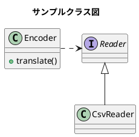

# Project Title

My Git learning project.

## Description


@import "test.puml"


```plantuml
@startuml aaa
title サンプルクラス図
class Encoder {
   + translate()
}
Interface Reader
Reader <|-- CsvReader
Encoder .> Reader
@enduml


## Getting Started

### Dependencies

* T.B.D.
* T.B.D.

### Installing

* T.B.D.
* T.B.D.

### Executing program

* T.B.D.
* T.B.D.
```
T.B.D.
```

## Help

* T.B.D.
```
T.B.D.
```
