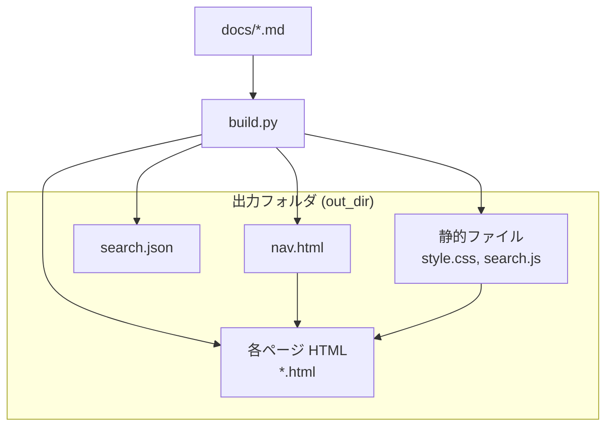
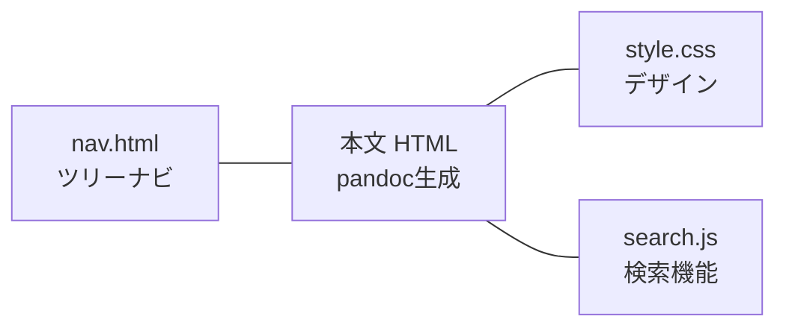
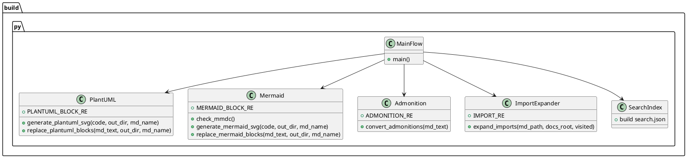
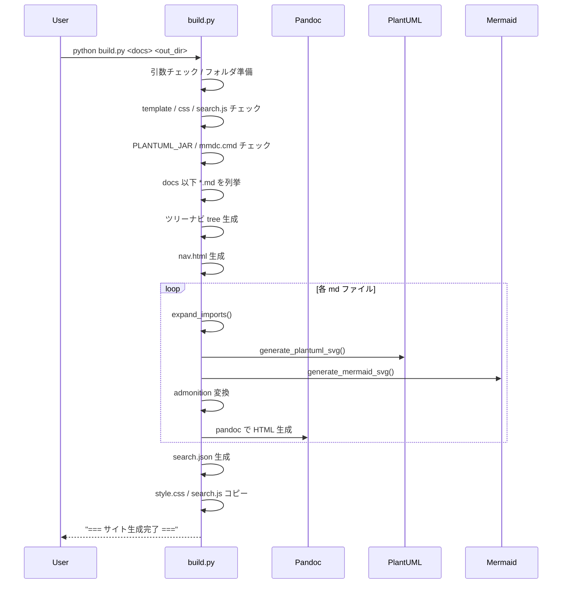

# build.py 設計書

## 1. 概要

**目的:**  
`docs` 以下の Markdown から静的 HTML ドキュメントサイトを生成するビルドツール。

**主な機能:**

- Markdown → HTML 変換（Pandoc）
- ツリーナビ (`nav.html`) 自動生成
- PlantUML / Mermaid 図の SVG 自動生成・キャッシュ
- `@import` による外部ファイル展開（md / puml / mermaid / json / yaml 等）
- GitHub Docs 風 Admonition の HTML 変換
- 検索用 `search.json` 生成
- CSS / JS の静的ファイルコピー

---

## 2. 画面構造（サイト構造）

### 2.1 サイト全体構成



### 2.2 1ページの画面レイアウト



- **左側:** `nav.html` によるツリーナビ
- **右側:** Markdown から生成された本文 HTML
- **共通:** `style.css` によるスタイル、`search.js` による検索 UI

---

## 3. ソースコード構造

### 3.1 モジュール構造（単一スクリプト）



---

## 4. 処理フロー（メイン処理）



---

## 5. 関数・メソッド単位の説明

### 5.1 `check_mmdc()`

**役割:**

- Mermaid CLI (`mmdc.cmd`) が利用可能かを確認。

**処理:**

- `subprocess.run(["mmdc.cmd", "-h"], ...)` を実行し、`FileNotFoundError` が出なければ `True`。
- 見つからない場合はエラー表示して終了。

---

### 5.2 `build_nav_html(tree, indent="")`

**役割:**

- `docs` 以下のファイルツリーから HTML のツリーナビ (`<ul><li>...`) を生成。

**ポイント:**

- ルート時のみ `Top` リンク (`index.html`) を追加。
- ディレクトリは入れ子の `<ul>` として再帰的に生成。
- ファイルは `docs` からの相対パスをフラットなファイル名（`/` や `\` を `_` に置換）に変換してリンク化。

---

### 5.3 `generate_plantuml_svg(code: str, out_dir: Path, md_name: str) -> str`

**役割:**

- PlantUML コードから SVG を生成し、`out_dir` に保存。
- 同一コードは SHA1 ハッシュでキャッシュ。

**処理:**

- `sha1(code)` でハッシュを取り、`plantuml-<md名>-<sha>.svg` をファイル名に。
- 既存ファイルがあればキャッシュ利用。
- 一時 `.puml` を作成し、`java -jar PlantUML.jar -tsvg` で SVG 生成。
- 最新の `.svg` をリネームして確定ファイルとし、一時ファイル削除。

---

### 5.4 `generate_mermaid_svg(code: str, out_dir: Path, md_name: str) -> str`

**役割:**

- Mermaid コードから SVG を生成し、`out_dir` に保存。
- 同一コードは SHA1 ハッシュでキャッシュ。

**処理:**

- `sha1(code)` でハッシュを取り、`mermaid-<md名>-<sha>.svg` をファイル名に。
- 既存ファイルがあればキャッシュ利用。
- 一時 `.mmd` を作成し、`mmdc.cmd -i ... -o ...` で SVG 生成。
- 一時ファイル削除。

---

### 5.5 `replace_plantuml_blocks(md_text: str, out_dir: Path, md_name: str) -> str`

**役割:**

- Markdown 内の ```plantuml ブロックを `` に置き換え。

**処理:**

- 正規表現 `PLANTUML_BLOCK_RE` で ` ```plantuml ... ``` ` を検出。
- 中身のコードを `generate_plantuml_svg()` に渡し、返ってきた SVG 名を `` タグに埋め込む。

---

### 5.6 `replace_mermaid_blocks(md_text: str, out_dir: Path, md_name: str) -> str`

**役割:**

- Markdown 内の ```mermaid ブロックを `` に置き換え。

**処理:**

- 正規表現 `MERMAID_BLOCK_RE` で ` ```mermaid ... ``` ` を検出。
- 中身のコードを `generate_mermaid_svg()` に渡し、返ってきた SVG 名を `` タグに埋め込む。

---

### 5.7 `convert_admonitions(md_text: str) -> str`

**役割:**

- GitHub 風 Admonition 記法を HTML の `<div class="admonition ...">` に変換。

**対象記法:**

```text
> [!NOTE]
> ここに本文
```

**処理:**

- `ADMONITION_RE` で `NOTE/TIP/WARNING/IMPORTANT/CAUTION` を検出。
- `> ` を取り除いた本文行を `<p>...</p>` に変換。
- `kind` をクラス名・タイトルに反映して HTML を生成。

---

### 5.8 `expand_imports(md_path: Path, docs_root: Path, visited=None)`

**役割:**

- Markdown 内の `@import "..."` を展開し、外部ファイルを取り込む。
- 再帰的に `.md` を展開しつつ、PlantUML / Mermaid / JSON / YAML などを適切に処理。

**主な処理ステップ:**

1. **循環検出:**
   - `visited` セットで同じ `md_path` が再訪問されたら警告コメントを返す。

2. **`wrap_codeblock(ext, code)`**
   - JSON / YAML などを ```json / ```yaml のコードブロックとしてラップ。

3. **`process_single_import(target: Path)`**
   - `.puml`: PlantUML SVG を生成し `` タグで挿入。
   - `.mermaid`: Mermaid SVG を生成し `` タグで挿入。
   - `.md`: 再帰的に `expand_imports()` を呼び出し、Markdown を展開。
   - `.json`: `wrap_codeblock("json", ...)` でコードブロック化。
   - `.yaml/.yml`: `wrap_codeblock("yaml", ...)` でコードブロック化。
   - その他: 生テキストとして挿入。

4. **`replace(match)`**
   - `@import "pattern"` の `pattern` が `*?[` を含む場合は `glob` で複数ファイルを展開。
   - それ以外は単一ファイルとして `process_single_import()`。

5. **展開後の後処理:**
   - `replace_plantuml_blocks()` で ```plantuml ブロックを画像化。
   - `replace_mermaid_blocks()` で ```mermaid ブロックを画像化。
   - `convert_admonitions()` で Admonition を HTML 化。

---

### 5.9 メインループ（HTML 生成）

**役割:**

- 各 Markdown ファイルに対して、`expand_imports()` → 一時 md → Pandoc → HTML 生成を行う。

**処理:**

1. `tmp_dir = out_dir / "_tmp"` を作成。
2. 各 `file in files` について:
   - 相対パスからフラットな HTML ファイル名 `flat` を生成。
   - `expanded_md = expand_imports(file, docs_root)` でインポート展開・図生成・Admonition 変換。
   - `tmp_md` に展開済み Markdown を書き出し。
   - `pandoc` コマンドを組み立てて `subprocess.run()` で HTML 生成。

---

## 6. 必要ツールのインストール方法とライセンス

### 6.1 前提環境

- **Python 3.x**
- **Java (JRE/JDK)**  
  PlantUML 実行に必要。
- **Node.js / npm**  
  Mermaid CLI インストールに必要。
- **Pandoc**

---

### 6.2 各ツールのインストール

#### 6.2.1 Pandoc

**インストール例（Windows）:**

- 公式サイトからインストーラをダウンロードして実行。

```text
https://pandoc.org/
```

**ライセンス:**

- GPL (GNU General Public License)

---

#### 6.2.2 PlantUML

**インストール:**

1. 公式サイトから `plantuml.jar` をダウンロード。
2. 環境変数 `PLANTUML_JAR` に `plantuml.jar` のパスを設定。

```text
set PLANTUML_JAR=C:\tools\plantuml.jar
```

**ライセンス:**

- LGPL (GNU Lesser General Public License)

---

#### 6.2.3 Mermaid CLI (`mmdc`)

**インストール:**

```bash
npm install -g @mermaid-js/mermaid-cli
```

**ライセンス:**

- Mermaid 本体: MIT License
- CLI 部分も MIT 系ライセンス

---

#### 6.2.4 Node.js / npm

**インストール:**

- 公式サイトからインストーラをダウンロードして実行。

```text
https://nodejs.org/
```

**ライセンス:**

- Node.js: MIT License

---

#### 6.2.5 Java (JRE/JDK)

**インストール:**

- OpenJDK などを利用するのが一般的。

```text
https://adoptium.net/
```

**ライセンス:**

- OpenJDK: GPL + Classpath Exception

---

#### 6.2.6 Python

**インストール:**

- 公式サイトからインストーラをダウンロードして実行。

```text
https://www.python.org/
```

**ライセンス:**

- Python Software Foundation License

---

## 7. 利用手順まとめ

1. **前提ツールをインストール:**
   - Python, Pandoc, Java, Node.js, Mermaid CLI, PlantUML.jar
2. **環境変数設定:**
   - `PLANTUML_JAR` に `plantuml.jar` のパスを設定。
3. **テンプレート・静的ファイル配置:**
   - `build.py` と同じディレクトリに `template.html`, `style.css`, `search.js` を配置。
4. **コマンド実行:**

```bash
python build.py <docsフォルダ> <出力先フォルダ>
```

5. **生成物:**
   - `<出力先フォルダ>` 以下に `nav.html`, 各ページ HTML, `search.json`, `style.css`, `search.js` が生成される。

---

