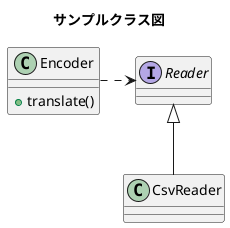

# Top

ようこそ

---
title: "GitHub Docs 風サンプル"
---

# h1 見出し（GitHub Docs 風）
GitHub Docs 風の h1 は左に青いラインが入ります。

本文はカード風の白背景で統一されています。

---

## h2 見出し（下線）
h2 は GitHub Docs と同じく下線が入ります。

---

### h3 見出し（太字）
h3 は太字で、シンプルな見出しです。

---

#### h4 見出し（小さめ太字）
h4 は小さめの太字で、階層がわかりやすくなっています。

---

##### h5 見出し（さらに小さく薄め）
h5 は薄めの色で、補助的な見出しとして使えます。

---

# 段落とリンク
これは通常の段落です。  
[GitHub Docs の例を見る](https://docs.github.com/)

---

# 箇条書き（ul）
- りんご
- みかん
- バナナ

---

# 番号付きリスト（ol）
1. 手順 1
2. 手順 2
3. 手順 3

---

# 引用（blockquote）
> これは引用です。  
> GitHub Docs 風に左線と背景色がつきます。

---

# コード（インライン）
`inline code` は背景色と枠線がつきます。

---

# コードブロック（pre）
```powershell
# PowerShell の例
Get-ChildItem -Recurse -Filter *.md
```





```ruby:qiita.rb
puts 'The best way to log and share programmers knowledge.'
```

