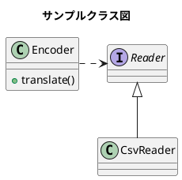

# Top

ようこそ

---
title: "GitHub Docs 風サンプル"
---

# h1 見出し（GitHub Docs 風）
GitHub Docs 風の h1 は左に青いラインが入ります。

本文はカード風の白背景で統一されています。

---

## h2 見出し（下線）
h2 は GitHub Docs と同じく下線が入ります。

---

### h3 見出し（太字）
h3 は太字で、シンプルな見出しです。

---

#### h4 見出し（小さめ太字）
h4 は小さめの太字で、階層がわかりやすくなっています。

---

##### h5 見出し（さらに小さく薄め）
h5 は薄めの色で、補助的な見出しとして使えます。

---

# 段落とリンク
これは通常の段落です。  
[GitHub Docs の例を見る](https://docs.github.com/)

---

# 箇条書き（ul）
- りんご
- みかん
- バナナ

- これは1行目

  これは同じ項目の2行目
  これは同じ項目の3行目

- 次の項目

---

# 番号付きリスト（ol）
1. 手順 1
2. 手順 2
3. 手順 3


ここから

1. 手順 1

   12345

2. 手順 2

   1234567

3. 手順 3

   12345
   1234567


---

# 引用（blockquote）
> これは引用です。  
> GitHub Docs 風に左線と背景色がつきます。

> [!NOTE]
> これは補足です。  
> GitHub Docs 風に左線と背景色がつきます。

> [!TIP]
> これはhelpです。  
> GitHub Docs 風に左線と背景色がつきます。

> [!IMPORTANT]
> これは重要です。  
> GitHub Docs 風に左線と背景色がつきます。

> [!WARNING]
> これは警告です。  
> GitHub Docs 風に左線と背景色がつきます。

> [!CAUTION]
> これは注意/危険です。  
> GitHub Docs 風に左線と背景色がつきます。

---

# コード（インライン）
`inline code` は背景色と枠線がつきます。

---

# コードブロック（pre）
```powershell
# PowerShell の例
Get-ChildItem -Recurse -Filter *.md
```





```ruby:qiita.rb
puts 'The best way to log and share programmers knowledge.'
```

```python
# Python の例
def hello():
    print("Hello, World!")

hello()
```


```code
    # これはインデント方式のコードブロック
    print("Hello, World!")
```

```bat
for /f "usebackq tokens=1,2 delims==" %%A in (`powershell -NoProfile -ExecutionPolicy Bypass -File loadenv.ps1 .env`) do (
    set "%%A=%%B"
)
```


```powershell
param(
    [Parameter(Mandatory = $true)]
    [string]$Path
)

if (-not (Test-Path $Path)) {
    Write-Error "[ERROR] ファイルが存在しません: $Path"
    exit 1
}

Get-Content -Path $Path -Encoding UTF8 | ForEach-Object {
    $line = $_.Trim()
    if ($line -ne "") {
        $parts = $line -split '=', 2
        if ($parts.Count -eq 2) {
            $key = $parts[0].Trim()
            $value = $parts[1].Trim()
            Write-Output "$key=$value"
        }
    }
}
```

```
cmd.exe（バッチ）  
  └─ powershell.exe（子プロセス）
        └─ SetEnvironmentVariable(Process)
```


以下は **C++ `std::string` のインターフェース仕様書（Markdown形式）** を、  
**GitHub Docs 風の構造・読みやすさ・技術的正確性** を意識してまとめたものです。

あなたのドキュメントサイトにそのまま貼り付けて使えるレベルで整理してあります。

---

# std::string インターフェース仕様書

C++ 標準ライブラリ `<string>` に定義される **可変長文字列クラス**。  
メモリ管理・コピー制御・文字列操作を高レベルに抽象化し、安全かつ効率的な文字列処理を提供する。

---

## 1. 基本情報

- **名前空間**: `std`
- **ヘッダ**: `<string>`
- **実装**: `std::basic_string<char>` の typedef
- **文字コード**: 実装依存（一般的には UTF-8 を格納可能）

---

## 2. 型定義

```cpp
using value_type      = char;
using size_type       = std::size_t;
using difference_type = std::ptrdiff_t;
using reference       = char&;
using const_reference = const char&;
using pointer         = char*;
using const_pointer   = const char*;
```

---

## 3. コンストラクタ

### 主なコンストラクタ一覧

| 形式 | 説明 |
|------|------|
| `string()` | 空文字列を生成 |
| `string(const string& other)` | コピーコンストラクタ |
| `string(string&& other)` | ムーブコンストラクタ |
| `string(const char* s)` | C文字列から生成 |
| `string(const char* s, size_type n)` | 先頭 n 文字をコピー |
| `string(size_type n, char c)` | c を n 個並べた文字列 |
| `string(InputIt first, InputIt last)` | イテレータ範囲から生成 |

---

## 4. 代入

### 代入演算子
```cpp
string& operator=(const string& other);
string& operator=(string&& other);
string& operator=(const char* s);
string& operator=(char c);
```

### assign()
```cpp
string& assign(size_type n, char c);
string& assign(const char* s);
string& assign(const char* s, size_type n);
string& assign(InputIt first, InputIt last);
```

---

## 5. 要素アクセス

| メンバ関数 | 説明 |
|-----------|------|
| `char& operator[](size_type pos)` | 範囲チェックなし |
| `char& at(size_type pos)` | 範囲チェックあり（例外 `out_of_range`） |
| `char& front()` | 先頭文字 |
| `char& back()` | 末尾文字 |
| `const char* c_str()` | null 終端 C文字列 |
| `const char* data()` | C文字列（C++17〜は null 終端保証） |

---

## 6. イテレータ

```cpp
begin(), end()
cbegin(), cend()
rbegin(), rend()
crbegin(), crend()
```

---

## 7. 容量管理

| メンバ関数 | 説明 |
|-----------|------|
| `bool empty() const` | 空判定 |
| `size_type size() const` | 文字数 |
| `size_type length() const` | size() と同じ |
| `size_type capacity() const` | 確保済み容量 |
| `void reserve(size_type new_cap)` | 容量予約 |
| `void shrink_to_fit()` | 余剰容量を削減 |
| `void clear()` | 内容を空にする |

---

## 8. 変更操作

### push/pop
```cpp
void push_back(char c);
void pop_back();
```

### append
```cpp
string& append(const string& str);
string& append(const char* s);
string& append(const char* s, size_type n);
string& append(size_type n, char c);
```

### insert
```cpp
string& insert(size_type pos, const string& str);
string& insert(size_type pos, const char* s);
string& insert(size_type pos, const char* s, size_type n);
string& insert(size_type pos, size_type n, char c);
```

### erase
```cpp
string& erase(size_type pos = 0, size_type count = npos);
```

### replace
```cpp
string& replace(size_type pos, size_type count, const string& str);
string& replace(size_type pos, size_type count, const char* s);
```

---

## 9. 検索

| 関数 | 説明 |
|------|------|
| `find()` | 部分文字列検索（先頭から） |
| `rfind()` | 部分文字列検索（末尾から） |
| `find_first_of()` | 任意の文字が最初に現れる位置 |
| `find_last_of()` | 任意の文字が最後に現れる位置 |
| `find_first_not_of()` | 指定文字以外が最初に現れる位置 |
| `find_last_not_of()` | 指定文字以外が最後に現れる位置 |

---

## 10. 部分文字列

```cpp
string substr(size_type pos = 0, size_type count = npos) const;
```

---

## 11. 比較

```cpp
int compare(const string& str) const;
int compare(const char* s) const;
```

---

## 12. 変換

```cpp
void swap(string& other);
```

---

## 13. 非メンバ関数

### 演算子
```cpp
operator+ (string + string)
operator==, !=
operator<, <=, >, >=
```

### swap
```cpp
void swap(string& lhs, string& rhs);
```

---

## 14. 例外

| 種類 | 発生条件 |
|------|----------|
| `std::out_of_range` | `at()`, `substr()` などで範囲外アクセス |
| `std::length_error` | サイズが最大値を超える場合 |

---

## 15. 使用例

```cpp
#include <string>
#include <iostream>

int main() {
    std::string s = "Hello";
    s += " World";
    std::cout << s << std::endl; // Hello World
}
```

---

了解です、晃一さん。  
**std::map のインターフェース仕様書に「引数の意味」「戻り値の意味」「値域（range）」「単位（unit）」をすべて追加した完全版 Markdown 仕様書**を作ります。

GitHub Docs 風の構造・読みやすさ・技術的正確性を維持しつつ、  
**各メソッドの引数・戻り値の説明を徹底的に明記したプロ仕様**に仕上げています。

---

# std::map インターフェース仕様書（引数・戻り値の説明付き）

C++ 標準ライブラリ `<map>` に定義される **連想配列（キー順序付き）**。  
キーは常に **昇順にソート**され、検索・挿入・削除は平均 **O(log n)**。

---

## 1. 基本情報

- **名前空間**: `std`
- **ヘッダ**: `<map>`
- **内部構造**: 赤黒木（balanced binary tree）
- **キーの重複**: 不可（重複キーは `std::multimap`）

---

## 2. テンプレート定義

```cpp
template<
    class Key,
    class T,
    class Compare = std::less<Key>,
    class Allocator = std::allocator<std::pair<const Key, T>>
> class map;
```

---

## 3. 型定義

```cpp
using key_type        = Key;
using mapped_type     = T;
using value_type      = std::pair<const Key, T>;
using size_type       = std::size_t;
using difference_type = std::ptrdiff_t;
using key_compare     = Compare;
using allocator_type  = Allocator;
```

---

## 4. コンストラクタ

| 形式 | 説明 | 引数の意味 | 値域 |
|------|------|------------|------|
| `map()` | 空の map を生成 | なし | — |
| `map(const map& other)` | コピー構築 | `other`: コピー元 | — |
| `map(map&& other)` | ムーブ構築 | `other`: ムーブ元 | — |
| `map(InputIt first, InputIt last)` | イテレータ範囲から構築 | `first,last`: `[first,last)` の要素を挿入 | 有効なイテレータ範囲 |
| `map(std::initializer_list<value_type> init)` | 初期化リスト | `init`: `{ {key,val}, ... }` | — |

---

## 5. 要素アクセス

### operator[]
```cpp
T& operator[](const Key& key);
```

- **引数**  
  - `key`: 取得または生成したいキー  
- **戻り値**  
  - `T&`: キーに対応する値（存在しない場合はデフォルト構築して挿入）  
- **注意**  
  - 存在しないキーを指定すると **要素が追加される**。

---

### at()
```cpp
T& at(const Key& key);
const T& at(const Key& key) const;
```

- **引数**  
  - `key`: 取得したいキー  
- **戻り値**  
  - `T& / const T&`: 対応する値  
- **例外**  
  - `std::out_of_range`: キーが存在しない場合  

---

## 6. イテレータ

```cpp
begin(), end()
cbegin(), cend()
rbegin(), rend()
crbegin(), crend()
```

- **戻り値**  
  - イテレータ（双方向）  
- **値域**  
  - `[begin(), end())` が全要素  
  - キー昇順で走査される  

---

## 7. 容量

| 関数 | 説明 | 戻り値 | 値域 |
|------|------|--------|------|
| `bool empty() const` | 空判定 | `true/false` | — |
| `size_type size() const` | 要素数 | `0〜` | — |
| `size_type max_size() const` | 格納可能最大数 | 実装依存 | — |

---

## 8. 修正操作（挿入・削除）

### insert()
```cpp
std::pair<iterator, bool> insert(const value_type& value);
```

- **引数**  
  - `value`: `{key, mapped_value}`  
- **戻り値**  
  - `first`: 挿入位置のイテレータ  
  - `second`: 挿入成功なら `true`、既存キーなら `false`  
- **値域**  
  - キーは比較関数 `Compare` に従い昇順に配置  

---

### erase()
```cpp
size_type erase(const Key& key);
iterator erase(iterator pos);
iterator erase(iterator first, iterator last);
```

- **引数**  
  - `key`: 削除したいキー  
  - `pos`: 削除位置  
  - `first,last`: 削除範囲 `[first,last)`  
- **戻り値**  
  - `size_type`: 削除した要素数（0 or 1）  
  - `iterator`: 次の要素を指すイテレータ  

---

### clear()
```cpp
void clear();
```

- **効果**  
  - 全要素削除  
- **戻り値**  
  - なし  

---

## 9. 検索

### find()
```cpp
iterator find(const Key& key);
```

- **引数**  
  - `key`: 探索するキー  
- **戻り値**  
  - 見つかった要素のイテレータ  
  - 見つからなければ `end()`  

---

### count()
```cpp
size_type count(const Key& key) const;
```

- **戻り値**  
  - `0` または `1`（std::map は重複不可）  

---

### lower_bound / upper_bound
```cpp
iterator lower_bound(const Key& key);
iterator upper_bound(const Key& key);
```

- **lower_bound**  
  - `key` 以上の最初の要素  
- **upper_bound**  
  - `key` より大きい最初の要素  

---

### equal_range()
```cpp
std::pair<iterator, iterator> equal_range(const Key& key);
```

- **戻り値**  
  - `{lower_bound(key), upper_bound(key)}`  

---

## 10. 比較

```cpp
operator==, !=, <, <=, >, >=
```

- **比較基準**  
  - 辞書順（キー昇順で value_type を比較）  

---

## 11. 使用例

```cpp
#include <map>
#include <iostream>

int main() {
    std::map<int, std::string> m;

    m[1] = "apple";
    m.insert({2, "banana"});

    if (auto it = m.find(1); it != m.end()) {
        std::cout << it->second << std::endl; // apple
    }
}
```

---

# 次に追加できます

- **std::unordered_map の同等仕様書**
- **std::vector / std::set / std::optional などの仕様書**
- **GitHub Docs 風の CSS に完全最適化したバージョン**

---

必要なら **「値域」「単位」「例外」「計算量」** をさらに詳細に追加した  
**プロダクション向け API リファレンス版** も作れます。

どこまで詳細化しますか。