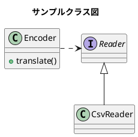

# Top

ようこそ

---
title: "GitHub Docs 風サンプル"
---

# h1 見出し（GitHub Docs 風）
GitHub Docs 風の h1 は左に青いラインが入ります。

本文はカード風の白背景で統一されています。

---

## h2 見出し（下線）
h2 は GitHub Docs と同じく下線が入ります。

---

### h3 見出し（太字）
h3 は太字で、シンプルな見出しです。

---

#### h4 見出し（小さめ太字）
h4 は小さめの太字で、階層がわかりやすくなっています。

---

##### h5 見出し（さらに小さく薄め）
h5 は薄めの色で、補助的な見出しとして使えます。

---

# 段落とリンク
これは通常の段落です。  
[GitHub Docs の例を見る](https://docs.github.com/)

---

# 箇条書き（ul）
- りんご
- みかん
- バナナ

- これは1行目

  これは同じ項目の2行目
  これは同じ項目の3行目

- 次の項目

---

# 番号付きリスト（ol）
1. 手順 1
2. 手順 2
3. 手順 3


ここから

1. 手順 1

   12345

2. 手順 2

   1234567

3. 手順 3

   12345
   1234567


---

# 引用（blockquote）
> これは引用です。  
> GitHub Docs 風に左線と背景色がつきます。

> [!NOTE]
> これは補足です。  
> GitHub Docs 風に左線と背景色がつきます。

> [!TIP]
> これはhelpです。  
> GitHub Docs 風に左線と背景色がつきます。

> [!IMPORTANT]
> これは重要です。  
> GitHub Docs 風に左線と背景色がつきます。

> [!WARNING]
> これは警告です。  
> GitHub Docs 風に左線と背景色がつきます。

> [!CAUTION]
> これは注意/危険です。  
> GitHub Docs 風に左線と背景色がつきます。

---

# コード（インライン）
`inline code` は背景色と枠線がつきます。

---

# コードブロック（pre）
```powershell
# PowerShell の例
Get-ChildItem -Recurse -Filter *.md
```





```ruby:qiita.rb
puts 'The best way to log and share programmers knowledge.'
```

```python
# Python の例
def hello():
    print("Hello, World!")

hello()
```


```code
    # これはインデント方式のコードブロック
    print("Hello, World!")
```

```bat
for /f "usebackq tokens=1,2 delims==" %%A in (`powershell -NoProfile -ExecutionPolicy Bypass -File loadenv.ps1 .env`) do (
    set "%%A=%%B"
)
```


```powershell
param(
    [Parameter(Mandatory = $true)]
    [string]$Path
)

if (-not (Test-Path $Path)) {
    Write-Error "[ERROR] ファイルが存在しません: $Path"
    exit 1
}

Get-Content -Path $Path -Encoding UTF8 | ForEach-Object {
    $line = $_.Trim()
    if ($line -ne "") {
        $parts = $line -split '=', 2
        if ($parts.Count -eq 2) {
            $key = $parts[0].Trim()
            $value = $parts[1].Trim()
            Write-Output "$key=$value"
        }
    }
}
```

```
cmd.exe（バッチ）  
  └─ powershell.exe（子プロセス）
        └─ SetEnvironmentVariable(Process)
```


